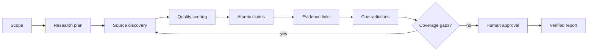

# Policy Evidence Engine

Policy Evidence Engine is an evidence-first public-policy research system. The demo follows one fixed, synthetic document collection so every result is reproducible and no live search key is required.

## Run locally

```bash
npm test
npm run serve
```

## Implemented

- Explainable, categorical source-quality scoring
- Atomic claim-to-evidence links with precise locators
- Temporal status labels from proposed through implemented/repealed
- Coverage matrix across requested jurisdictions and dimensions
- Deterministic contradiction detection that preserves disagreement
- Human approval step for qualified synthesis
- Interactive claim inspector and evidence provenance

## Workflow



Retrieved content is untrusted data, never executable instruction. A production adapter must block private-network URLs, cap content sizes, snapshot sources, hash content, enforce per-run budgets, and checkpoint graph state. Every material report sentence must reference a stored evidence record.

## Evaluation contract

Citation correctness and completeness, primary-source ratio, temporal-status accuracy, requested-dimension coverage, contradiction recall, unsupported-claim rate, cost, and latency. All figures in the demo are synthetic fixtures—not claims about real city policy.
